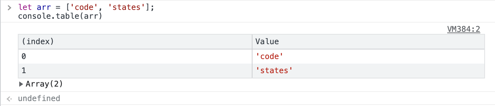

# Array

## 1. What is an Array?

A collection of values (elements) with order (index)

<br/>

## 2. Array Syntax

- Order starts from 0, not 1
- Use square brackets `[]` to create an array
- Separate each element with a comma `,`

<br/>

## 3. Array Index Finding/Adding/Deleting

### Getting Index Values

```javascript
let myNumber = [73, 98, 86, 61, 96];
// What is the value at the 3rd index of the myNumber array?
myNumber[3]; // 61

let myNumber = [73, 98, 86, 61, 96];
// What is the value at the 5th index of the myNumber array?
myNumber[5]; // undefined: this array only has values up to the 4th index
```

### Getting Index Values from Arrays Inside Arrays

```javascript
let myNumber = [
  [13, 30],
  [73, 8],
  [44, 17],
];
// What is the value at the 1st index of the myNumber array?
myNumber[1]; // [73, 8]: Note, not [13]!

let myNumber = [
  [13, 30],
  [73, 8],
  [44, 17],
];
// What is the value at the 0th index of the 1st index value of the myNumber array?
myNumber[1]; // 73

let myNumber = [
  [13, 30],
  [73, 8],
  [44, 17],
];
myNumber[1]; // [73, 8]
myNumber[1][0]; // 73: You can also represent it by attaching brackets like this
```

### Finding Array Length

```javascript
let myNumber = [73, 98, 86, 61];
// What is the length of the myNumber array?
myNumber.length; // 4: You can access properties that variables have using dot notation
```

```javascript
let myNumber = [73, 98, 86, 61];

// To 'add' the value 96 to the end of the myNumber array
myNumber.push(96);

// To 'delete' the last value of the myNumber array
myNumber.pop();
```

- Adding/deleting elements **at the end** of an array
- You can execute related commands (methods) using dot notation (.)
- When executing commands, you can run them in the form of opening and closing parentheses like calling a function

<br/>

## 4. Array Iteration

### Using Loops to Print Each Element of an Array

```javascript
let myNum = [73, 98, 86, 61];
for (let n = 0; n < myNum.length; n++) {
  console.log(myNum[n]);
}
```

### Adding All Elements of an Array Cumulatively

If you don't assign 0 initially, undefined will be returned, and if you continue the calculation below without an initial value, NaN will result.

```javascript
let myNum = [10, 20, 40, 10];
let sum = 0;

for (let n = 0; n < myNum.length; n++) {
  // sum = 0 + 10 -> sum + myNum[0]
  // sum = 10 + 20 -> sum + myNum[1]
  // sum = 30 + 40 -> sum + myNum[2]
  // sum = 70 + 10 -> sum + myNum[3] -> In other words, this form

  sum = sum + myNum[n]; // Calculate sum like this
}
console.log(sum); // 80
```

<br/>

## 5. Object Value Lookup Methods

### Array.isArray

Determining whether a specific value is an array or not

```javascript
let words = ['frontend', 'developer'];
typeof words; // "object": the type of words array made of strings is object

typeof [1, 2, 3]; // "object": the type of array made of numbers is object

Array.isArray('string'); // false: string is not an array
Array.isArray(123); // false: number is not an array

Array.isArray(words); // true: words is indeed in array form
Array.isArray([]); // true: square brackets mean array, so it's correct
```

### push, pop

Adding or deleting elements of an array

```javascript
let arr = ['frontend', 'engineer'];
console.table(arr) // Array(2)

arr.push('ella') // Add 'ella' element at the end
console.table(arr) // Array(3)

arr.pop() // Remove the last element
console.table(arr) // Array(2)

arr.shift() // Remove the first element
console.table(arr) // Array(1)

arr.unshift('good') // Add 'good' element at the beginning
console.table(arr) // Array(2)


```

### indexOf

Checking if a specific value is included in an array and finding its index value

```javascript
let word = ['front', 'end', 'engineer'];

word.indexOf('end'); // 1: the index value where the element is located
word.indexOf('engineer'); // 2: the index value of engineer
word.indexOf('ella'); // -1: displays -1 because the word doesn't exist

word.indexOf('front') !== -1; // true: is it not -1? In other words, is the word there? -> yes (true)
word.indexOf('ella') !== -1; // false: is it not -1? In other words, is the word there? -> no (false)

word.indexOf('FRONT'); // -1: be careful as it distinguishes between uppercase and lowercase
```

### includes

Checking if a specific value is included in an array

```javascript
// 1. Method using functions
// Function that returns false/true for whether a specific element is included in a specific array
// hasElement(array, element to find) -> true or false

function hasElement(arr, element) {
  let isPresent = arr.indexOf(element) !== -1; // if the element to find exists (i.e., is not absent)
  return isPresent; // return that value
}
hasElement(words, 'end'); // true
hasElement(words, 'ella'); // false

// 2. Method using built-in methods
let words = ['front', 'end', 'engineer'];
words.includes('end'); // true
words.includes('ella'); // false
```
