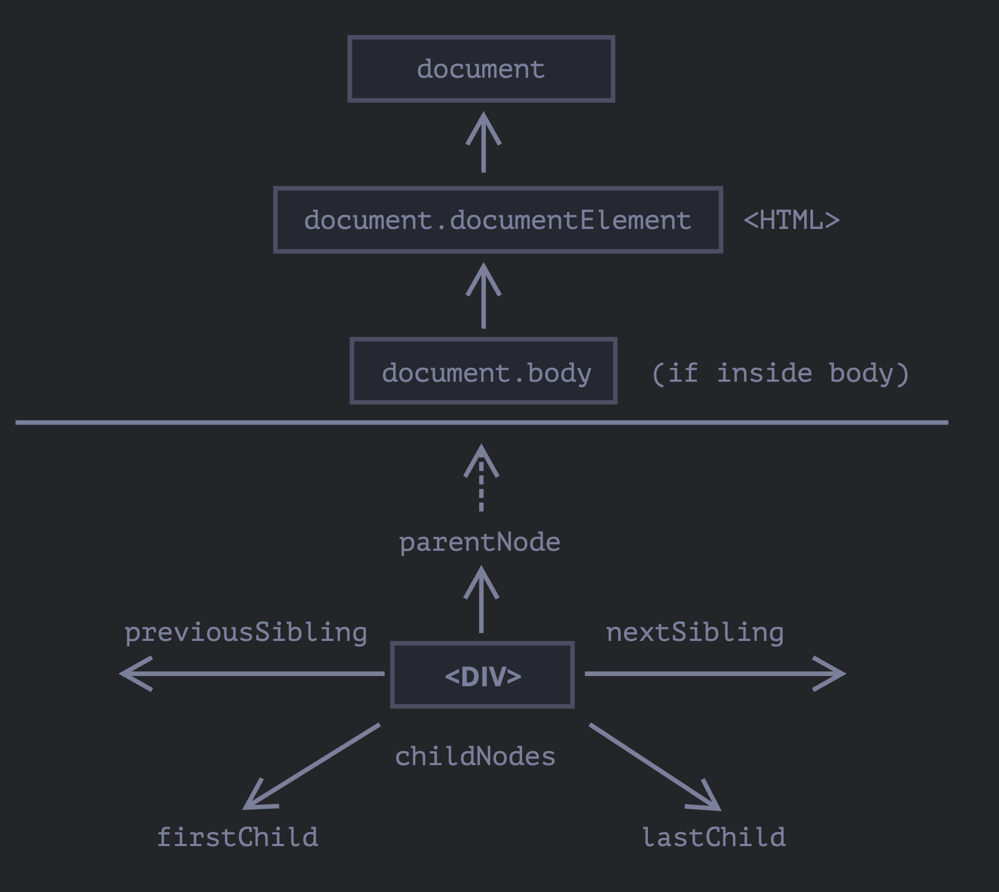

## **DOM 탐색하기** <p>
- DOM에 수행하는 모든 연산은 document 객체에서 시작하며, 이는 DOM에 접근하기 위한 '진입점' 이라고 보면 된다.

- `<html>` = document.documentElement
  document를 제외하고 DOM 트리 꼭대기에 있는 문서 노드는 <html> 태그에 해당
- `<body>` = document.body
- `<head>` = document.head

<br/>

### **1. childNodes, firstChild, lastChild로 자식 노드 탐색하기** <p>
- 자식 노드 (child node, children): 바로 아래의 자식 요소이며, 부모 노드 바로 아래에서 중첩 관계를 만듦.
- 후손 노드(descendants): 중첩 관계에 있는 모든 요소들이며, 자식 노드와 자식 노드의 모든 자식 노드 등이 포함.
- firstChild와 lastChild 프로퍼티를 이용하면 첫 번째, 마지막 자식 노드에 빠르게 접근할 수 있기도 하다.

<br/>

### **2. DOM 컬렉션** <p>
- contents
- contents

  ```javascript
  
  ```

<br/>

### **3. Title** <p>
- contents
- contents

  ```javascript
  
  ```
<br/>

### **4. Title** <p>
- contents
- contents

  ```javascript
  
  ```

<br/>