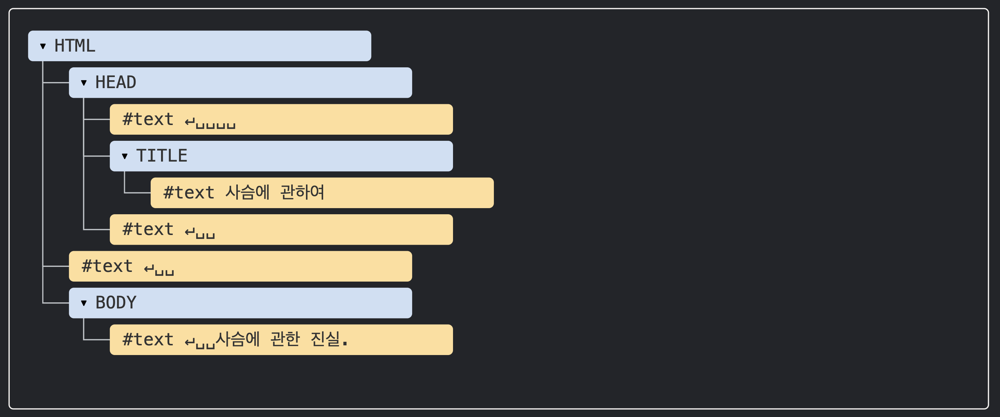
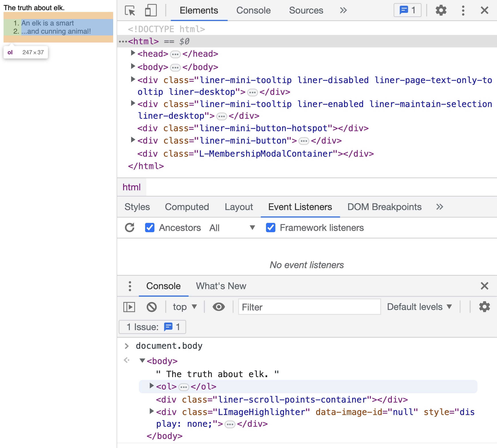

# DOM Tree

- According to the Document Object Model (DOM), all HTML tags are objects. Tags that wrap child tags are called nested tags. Text within tags is also an object. All objects can be accessed through JavaScript and these objects are used when manipulating pages.

<br/>

## 1. DOM Structure

```html
<!DOCTYPE html>
<html>
  <head>
    <title>About Deer</title>
  </head>
  <body>
    The truth about deer.
  </body>
</html>
```



- All nodes in the tree are objects. Tags are element nodes and constitute the tree structure. `<html>` becomes the root node, and `<head>` and `<body>` become children of the root node.
- Text within elements becomes text nodes. In the figure above, #text only contains strings, cannot have child nodes, and becomes a leaf node at the end of the tree.
- Special characters in text nodes are always treated as valid characters, so the two special characters below become text nodes and become part of the DOM.
  - New line: ↵ (displayed as \n in JavaScript)
  - Space: `␣`
- However, there are two exceptions to text node creation.
  - For historical reasons, spaces and new lines before `<head>` are ignored.
  - According to HTML specifications, all content must be inside body, so even if you put something after `</body>`, that content is automatically moved inside body. Therefore, there cannot be spaces after `</body>`.

<br/>

## 2. Automatic Correction

- When encountering malformed HTML, browsers automatically correct the HTML during DOM creation (e.g., top-level tag should always be `<html>` but is missing, or closing tags are missing)
- cf. When using tables, DOM requires `<tbody>` to exist, but HTML omits this, so browsers automatically create `<tbody>` in the DOM.

<br/>

## 3. Other Node Types

- Comments also become nodes. As shown below, comment nodes are added to the DOM even though they don't affect screen output. Everything in HTML, even comments, constitutes the DOM.

  ```html
  <!-- comment -->
  ```

- Similarly, `<!DOCTYPE>` at the top of HTML documents also becomes a DOM node. The document object representing the entire document is also a DOM node.

<br/>

## \*\*4. Using Console to Handle DOM

- You can also explore DOM nodes by entering document.body in the developer tools console window, which is used for debugging purposes.

  
