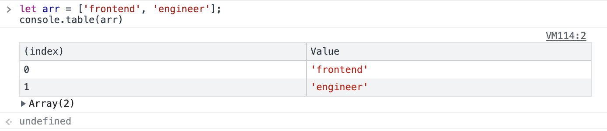

### ****Chapter1-1. 배열 기초****

1. **배열은 순서(index)가 있는 값(element)**
    1. 순서(index)가 있는 값(element)의 집합이다.
    2. 이때, 순서는 1이 아니라 0부터 번호를 매기며, 대괄호 [ ]를 이용해 배열을 만들고, 각각의 원소(element)는 쉼표(,)로 구분해 준다.
2. **예시 코드**
    1. 인덱스 값 구하기
        
        ```jsx
        let myNumber = [73, 98, 86, 61, 96];
        // myNumber 라는 배열의 3번째 인덱스 값은?
        myNumber[3]; // 61
        
        let myNumber = [73, 98, 86, 61, 96];
        // myNumber 라는 배열의 5번째 인덱스 값은?
        myNumber[5]; // undefined : 이 배열은 4번째 인덱스 값 까지 밖에 없다.
        ```
        
    2. 배열 안에 있는 배열의 인덱스 값 구하기
        
        ```jsx
        let myNumber = [[13, 30], [73, 8], [44, 17]];
        // myNumber 라는 배열의 1번째 인덱스 값은?
        myNumber[1]; // [73, 8]: [13] 아님 주의!
        
        let myNumber = [[13, 30], [73, 8], [44, 17]];
        // myNumber 라는 배열의 1번째 인덱스값의 0번째 인덱스의 값은?
        myNumber[1]; // 73
        
        let myNumber = [[13, 30], [73, 8],[44, 17]]; 
        myNumber[1]; // [73, 8]
        myNumber[1][0]; // 73: 이렇게 대괄호와 대괄호를 붙여서도 나타낼 수 있다.
        ```
        
    3. 배열로 길이 알아내기
        
        ```jsx
        let myNumber = [73, 98, 86, 61];
        // myNumber 배열의 길이는?
        myNumber.length; // 4: 온점을 활용해 변수가 가지고 있는 속성에 접근 가능
        ```
        
    4. 배열로 **맨 뒤에** 요소 추가/삭제 하기
        
        온점(.)으로 관련된 명령(method: 흔히 말하는 메소드)도 실행 가능하며, 명령을 실행할 때는 함수를 실행하듯 괄호 열고 닫기 형태로 실행할 수 있다.
        
        ```jsx
        ley myNumber = [73, 98, 86, 61];
        
        // myNumber 배열 끝에 96 이라는 값을 '추가'하려면
        myNumber.push(96); 
        
        // myNumber 배열 마지막 값을 '삭제'하려면
        myNumber.pop();
        ```
        

### ****Chapter1-2. 배열의 반복****

1. **예시 코드**
    1. 반복문을 이용해 배열의 요소를 한번씩 출력하기
        
        ```jsx
        let myNum = [73, 98, 86, 61];
        for (let n = 0; n < myNum.length; n++) { // for문을 모르신다면 복습하고 오시라..
        	console.log(myNum[n]);
        }
        ```
        
    2. 배열의 모든 요소를 누적해서 더하기
        
        이때, 처음에 0 할당을 하지 않으면 undefined가 나오고, 초기값을 넣지 않은 상태로 아래의 계산을 쭉 진행하면 NaN이 나올 것이다.
        
        ```jsx
        let myNum = [10, 20, 40, 10];
        let sum = 0; 
        
        for(let n = 0; n < myNum.length; n++) {
        // sum = 0 + 10 -> sum + myNum[0]
        // sum = 10 + 20 -> sum + myNum[1]
        // sum = 30 + 40 -> sum + myNum[2]
        // sum = 70 + 10 -> sum + myNum[3] -> 말하자면 이런 형태이니
        
        sum = sum + myNum[n]; // sum은 이런 식으로 계산하자
        }
        console.log(sum); // 80
        ```
        

### ****Chapter1-3. 배열 메소드****

1. **메소드 종류와 예시 코드**
    1. **Array.isArray** : 특정 값이 배열인지 아닌지 판별하기
        
        ```jsx
        let words = ['프론트', '엔드', '개발자'];
        typeof words // "object" : 문자열로 이루어진 words 라는 배열의 type은 object임
        
        typeof [1, 2, 3] // "object" : 숫자로 이루어진 배열의 type은 object임
        
        Array.isArray('문자열') // false : 문자열은 배열이 아님
        Array.isArray(123) // false : 숫자는 배열이 아님
        
        Array.isArray(words) // true : words은 배열 형태가 맞음
        Array.isArray([]) // true : 대괄호는 배열을 의미하므로 배열이 맞음
        ```
        
    2. **push, pop** : 배열의 요소를 추가하거나, 삭제하기
        
        ```jsx
        let arr = ['frontend', 'engineer'];
        console.table(arr) // Array(2)
        
        arr.push('ella') // 맨 뒤에 'pre' 라는 요소 추가
        console.table(arr) // Array(3)
        
        arr.pop() // 맨 뒤의 요소 제외
        console.table(arr) // Array(2)
        
        arr.shift() // 맨 앞의 요소 제외
        console.table(arr) // Array(1)
        
        arr.unshift('good') // 맨 앞에 'good' 라는 요소 추가
        console.table(arr) // Array(2)
        ```
        
        )
        
    3. **indexOf** : 특정 값이 배열에 포함되어 있는지 확인하고, 인덱스 값을 알아내기
        
        ```jsx
        let word = ['front', 'end', 'engineer'];
        
        word.indexOf('end') // 1 : 해당 elemment가 들어있는 인덱스 값
        word.indexOf('engineer') // 2 : engineer의 인덱스 값
        word.indexOf('ella') // -1 : 없는 단어이므로 -1 표시됨
        
        word.indexOf('front') !== -1 // true : -1이 아니냐? 즉, 단어가 있는거 맞냐? -> 있다(true)
        word.indexOf('ella') !== -1 // false : -1이 아니냐? 즉, 단어가 있는거 맞냐? -> 없다(false)
        
        word.indexOf('FRONT') // -1 : 대소문자를 구분하니 주의
        ```
        
    4. **includes** : 특정 값이 배열에 포함되어 있는지 확인 하기
        
        함수를 활용하거나, includes 메소드를 활용하는 두 가지 방법이 있다.
        
        ```jsx
        // 1. 함수를 활용하는 방법
        // 특정한 배열에 찾고자하는 element 포함 여부를 false/true로 반환하는 함수
        // hasElement(배열, 찾으려는 엘리먼트) -> true or false
        
        function hasElement(arr, element) {
        	let isPresent = arr.indexOf(element) !== -1; // 찾으려는 element가 있다면 (= 없지 않다면)
        	return isPresent; // 해당 값을 리턴하라
        }
        hasElement(words, 'end') // true
        hasElement(words, 'ella') // false
        
        // 2. 메소드를 활용하는 방법
        let words = ['front', 'end', 'engineer'];
        words.includes('end') // true
        words.includes('ella') // false
        ```