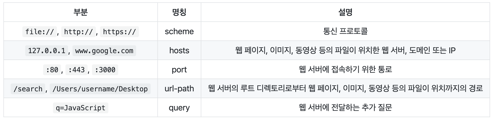
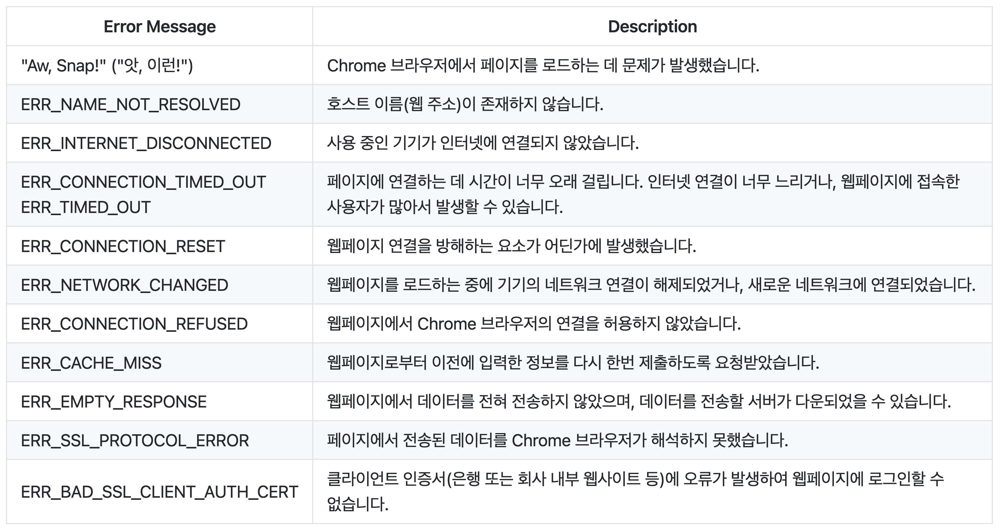

## **브라우저의 작동 원리(보이지 않는 곳)** ##
### 1. URL과 URI
  - URL(Uniform Resource Locator): 네트워크상에서의 웹페이지, 이미지, 동영상 등의 파일이 위치한 정보를 나타냄
     - scheme: 통신방식(프로토콜)을 결정하며, 보통 http(s)사용
     - hosts: 웹 서버의 이름이나 도메인, IP를 사용해 주소를 나타냄
     - url-path: 웹 서버에서 지정한 루트 디렉토리부터 시작해 웹페이지, 파일이 위치한 경로와 파일명 나타냄
   - URI(Uniform Resource Indentifier): 일반적으로 URL의 기본 요소인 scheme, hosts, url-path에 더해 query, fragment를 포함
     - query: 웹 서버에 보내는 추가적인 질문
     - fragment: 일종의 북마크 기능을 수행, URL에 fragment(#)와 특정 HTML 요소의 id를 전달하면 해당 요소가 있는 곳으로 스크롤을 이동 가능
  - 정리하자면, 
    
    - 브라우저의 검색창을 클릭하면 나타나는 주소가 URI
    - URI는 URL을 포함하는 상위개념
      - 'URL은 URI다.' == true
      - 'URI는 URL이다.' == false
  
 

### 2. IP와 PORT
- IP(Internet Protocal) adress: 네트워크에 연결된 특정 PC의 주소를 나타내는 체계
  - localhost, 127.0.0.1 : 현재 사용 중인 로컬 PC를 지칭
  - 0.0.0.0, 255.255.255.255 : broadcast address, 로컬 네트워크에 접속된 모든 장치와 소통하는 주소. 서버에서 접근 가능 IP 주소를 broadcast address 로 지정하면, 모든 기기에서 서버에 접근 가능
- PORT: IP주소가 가리키는 PC에 접근할 수 있는 통로(채널) ex) 리액트 실행 시 로컬 PC의 IP주소로 접근해 3000번의 통로를 통해 실행중인 리액트 확인 가능
  - 22 : SSH
  - 80 : HTTP
  - 443: HTTPS
  
 

### 3. 도메인과 DNS
- 도메인
     - IP주소를 대신해 사용하는 주소: 비유하자면 IP주소가 도로명주소, 도메인은 상호명
     - ex) IP 주소는 3.34.153.168, 도메인 이름은 codestates.com
     - 터미널에서 도메인 이름을 통해 IP주소를 확인하는 명령어 'nslookup'로 IP주소 확인 가능
- DNS
     - 도메인 이름과 매칭된 IP주소를 확인하는 작업을 위해 존재하는 서버
     - 호스트의 도메인 이름을 -> IP주소로 변환 or IP주소를 -> 도메인 이름으로 변환하기 위해 개발된 DB 시스템
     - DNS가 해당 IP 주소/도메인에 해당하면 웹 서버로 요청을 전달해 클라이언트와 서버가 통신할 수 있도록 함
  
 

### 4. 크롬 브라우저와 에러 읽기
   

 

## **브라우저의 작동 원리 (보이는 곳)** ##
### 1. SPA를 만드는 기술: AJAX
  - 정의와 특징
     - Asynchronous JavaScript And XMLHttpRequest의 약자
     - JavaScript, DOM, Fetch, XMLHttpRequest, HTML 등의 다양한 기술을 사용하는 웹 개발 기법
     -  웹 페이지에 필요한 부분에 필요한 데이터만 비동기적으로 받아와 화면에 그려낼 수 있다는 것이 가장 큰 특징
  - 핵심 기술
    - JavaScript, DOM
      - Fetch: 페이지를 이동하지 않아도 서버로부터 필요한 데이터를 받아올 수 있으며, 사용자가 현재 페이지에서 작업하는동안 서버와 통신할 수 있도록 함. 즉, 브라우저는 Fetch가 서버에 요청을 보내고 응답을 받을 때까지 동작을 멈추는 것이 아니라 비동기적인 방식을 사용해 계속해서 페이지를 사용할 수 있도록 함
      - Fetch를 통해 필요한 데이터만 가져와 DOMd에 적용시켜 기존 페이지에서 필요한 부분만 변경
  - AJAX의 장점
    - 서버에서 HTML을 완성하여 보내주지 않아도 웹페이지를 만들 수 있음
    - 표준화된 방법
    - 유저 중심 애플리케이션 개발
    - 더 작은 대역폭(네트워크 통신 한번에 보낼 수 있는 데이터 크기)
  - AJAX의 단점
    - SEO에 불리

 

### 2. SSR과 CSR
   - SSR(Server Side Rendering)
     - 웹 페이지를 서버에서 렌더링
     - SEO가 우선이거나 빠른 첫 화면 렌더링이 필요한 경우, 유저와의 상호작용이 적은 경우
   - CSR(Client Side Rendering)
     - 웹 페이지를 클라이언트에서 렌더링
     - SEO 필요가 없거나 유저와의 상호작용이 많은 경우 CSR은 강력한 라우팅으로 강력한 사용자 경험 제공, 혹은 웹 애플리케이션을 제작하는 경우 빠른 동적 렌더링 제공 가능
