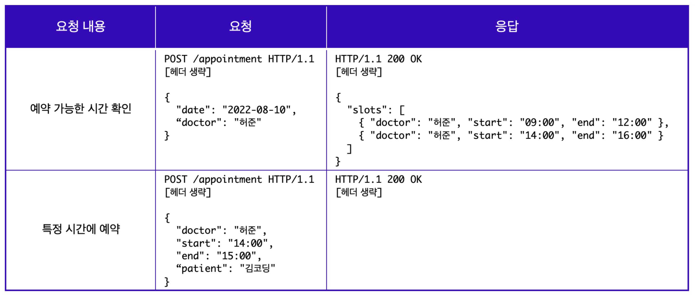
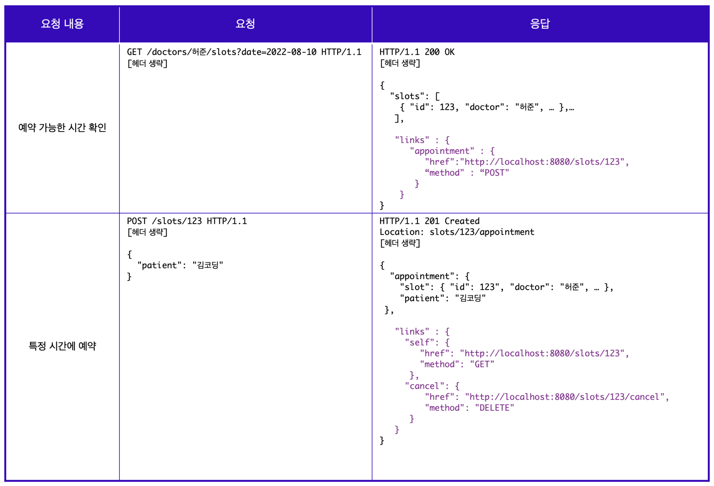

# 1. REST API

## 1. What is REST API?

A method that represents data or resources used on the web as HTTP URIs and defines requests and responses through HTTP protocol

 

## 2. REST API Design Method: Richardson's REST Maturity Model

- Level 0: Use HTTP
- Level 1: Comply with individual resource communication
- Level 2: Comply with HTTP method principles (can be considered good API design if followed up to this point)
- Level 3: Comply with HATEOAS principles

 

## 3. REST API Maturity Model - Level 0

- Simply using HTTP protocol is sufficient, but in this case, the API cannot be called a REST API
- It's just the basic stage for writing REST API

 

## 4. REST API Maturity Model - Level 1

- Comply with individual resource communication, meaning all resources must use Endpoints appropriate for individual resources
- Must provide information about requested and received resources as responses
- When writing endpoints, avoid using verbs, HTTP methods, or words about actions, and focus on resources using noun forms (ex. appointment)
- When delivering resources, must also return success/failure status of resource usage (ex. appointmentFailure)

 

## 5. REST API Maturity Model - Level 2

- Focus on using appropriate HTTP methods according to CRUD
- For example, use GET method for reading (READ), and since GET method doesn't have a body, use query parameters to deliver necessary resources
- Or use POST method for creation (CREATE), and since the response sends newly created resources, clearly write response code as `201 Created` so clients can check related resources through the URI written in the Location header

 

## 6. Rules When Using HTTP Methods

- `GET`: Used for requests that don't change server data
- `POST`: Creates new resources for each request, and `PUT` method returns the same resource for each request, which is called _idempotent._ When sending the same request once and sending it multiple times consecutively has the same effect, and the server state remains the same, that HTTP method is said to have idempotency. (Source: [mdn](https://developer.mozilla.org/ko/docs/Glossary/Idempotent))
- `PUT`: Replacement and `PATCH`: Modification methods also need to be distinguished.

 

## 7. REST API Maturity Model - Level 3

- HATEOAS (Hypermedia As The Engine Of Application State) applies hypermedia controls
- Must insert link elements including resource URIs in responses, and link elements include many hypermedia controls for various actions that can be done after receiving responses
- In other words, the point is to put new links in responses to enable access to new features.

 

## 8. Open API and API Key

### Open API

Public data is available, but must be used according to established rules

### API Key

A key that opens the server's door, provides access permissions to resources in the form of API Key to logged-in users, and must send API Key along with data requests to receive desired responses

 

## 9. Message State Request

### root-endpoint (or root-URL)

- Starting point where server accepts requests when communicating with server through API
- Generally, root-endpoint refers to the root (/) of the domain address
- Similarly, the root-endpoint that can be identified based on Message State Server's URL is the root (/) of the host, which is the last Location of Message States Server (ex. Github API's root-endpoint is <https://api.github.com>)

### path

- path or url-path acts as a key for communicating with server through API
- path differs according to strings defined in server (ex. 'user' is the path in <https://api.github.com/user>)
