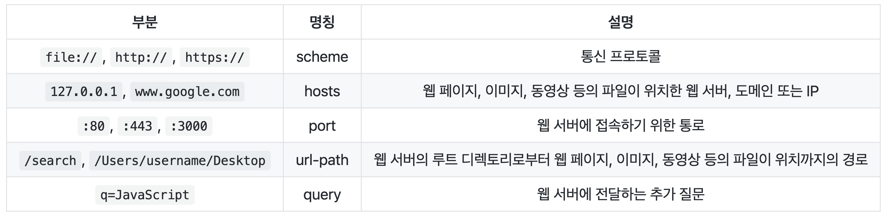
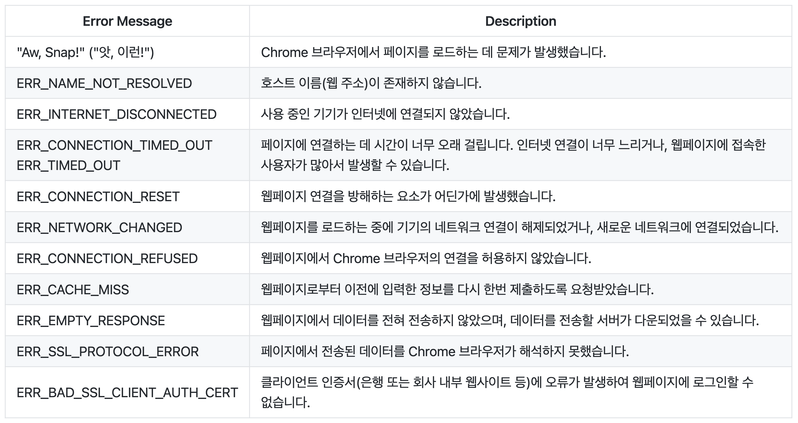

# Browser

## 1. How Browser Works (Invisible Part)

### (1) URL and URI

#### URL (Uniform Resource Locator)

- Represents information about the location of files such as web pages, images, videos, etc. on the network
- scheme: Determines communication method (protocol), usually uses http(s)
- hosts: Represents address using web server name or domain, IP
- url-path: Represents path and filename where web pages and files are located, starting from root directory specified by web server

#### URI (Uniform Resource Identifier)

- Generally includes query, fragment in addition to basic URL elements scheme, hosts, url-path
- query: Additional questions sent to web server
- fragment: Performs bookmark function, when passing fragment (#) and specific HTML element's id in URL, can scroll to where that element is located

#### To summarize

- Address that appears when clicking browser's search bar is URI
- URI is a superordinate concept that includes URL
- 'URL is URI' == true
- 'URI is URL' == false

### (2) IP and PORT

#### IP (Internet Protocol) Address

- System that represents address of specific PC connected to network
- localhost, 127.0.0.1: Refers to current local PC being used
- 0.0.0.0, 255.255.255.255: broadcast address, address for communicating with all devices connected to local network
- If server specifies accessible IP address as broadcast address, all devices can access server

#### PORT

- Channel (passage) to access PC pointed to by IP address
- e.g. When running React, can access local PC's IP address and check running React through channel 3000
- 22: SSH, 80: HTTP, 443: HTTPS

### (3) Domain and DNS

#### Domain

- Address used instead of IP address: To analogize, IP address is street address, domain is business name
- ex) IP address is 3.34.153.168, domain name is naver.com
- Can check IP address through domain name using 'nslookup' command in terminal

#### DNS

- Server that exists to check IP addresses matched with domain names
- DB system developed to convert host's domain name → IP address or IP address → domain name
- When DNS corresponds to that IP address/domain, forwards request to web server so client and server can communicate

### (4) Chrome Browser and Error Reading

 

## 2. How Browser Works (Visible Part)

### (1) Technology to Make SPA: AJAX

#### Definition and Characteristics

- Abbreviation of Asynchronous JavaScript And XMLHttpRequest
- Web development technique using various technologies like JavaScript, DOM, Fetch, XMLHttpRequest, HTML
- Biggest characteristic is that it can asynchronously receive only necessary data for necessary parts of web page and draw it on screen

#### Core Technologies

- JavaScript, DOM
- Fetch: Can receive necessary data from server without moving pages, and can communicate with server while user works on current page. In other words, browser doesn't stop operation when Fetch sends request to server and receives response, but uses asynchronous method to continue using page
- Apply necessary data received through Fetch to DOM to change only necessary parts on existing page

#### AJAX Advantages

- Can make web pages without server completing HTML and sending it
- Standardized method
- User-centered application development
- Smaller bandwidth (data size that can be sent in one network communication)

#### AJAX Disadvantages

- Unfavorable for SEO

### (2) SSR and CSR

#### SSR (Server Side Rendering)

- Renders web pages on server
- When SEO is priority or fast first screen rendering is needed, when user interaction is low

#### CSR (Client Side Rendering)

- Renders web pages on client
- When SEO is not needed or user interaction is high, CSR provides powerful routing for powerful user experience
- When making web applications, provides fast dynamic rendering
