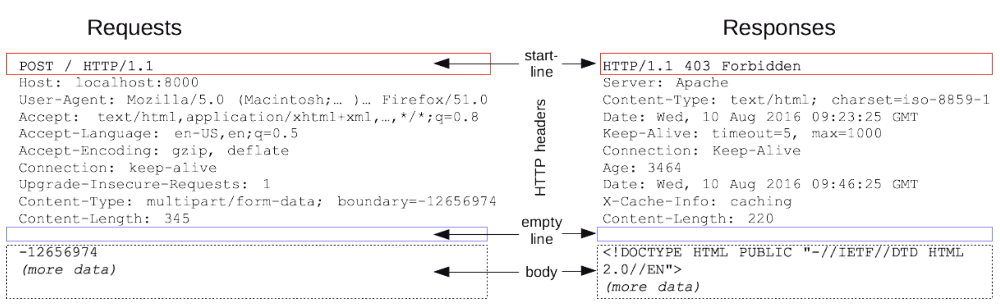

# HTTP

## 1. HTTP Messages

### 정의

- 클라이언트와 서버 사이에서 데이터가 교환되는 방식
- 요청과 응답은 아래와 같이 유사한 구조를 가지며, start line과 HTTP headers를 묶어 요청이나 응답의 head라고 하며, Payload는 body라고 함

### 구조

- start line: 요청이나 응답의 상태를 나타내며, 항상 첫 번째 줄에 위치하고, 응답에서는 status line이라 부름
- HTTP headers: 요청을 지정하거나, 메시지에 포함된 본문을 설명하는 헤더의 집합
- empty line: 헤더와 본문을 구분하는 빈 줄
- body: 요청과 관련된 데이터나 응답과 관련덴 데이터 또는 문서 포함, 유형에 따라 선택적 사용

 

## 2. HTTP Requests

클라이언트가 서버에게 보내는 메시지

### start line의 세 가지 요소

- 수행할 작업이나 방식을 설명하는 HTTP method
- 요청 대상 또는 프로토콜, 포트, 도메인의 절대경로는 요청 컨텍스트에 작성됨

### Headers

- 헤더이름, 콜론, 값을 입력
- General headers
- Request headers
- Representation headers

### Body

- 모든 요청에 필요하진 않음
- Single-resource bodies(단일-리소스 본문)
- Multiple-resource bodies(다중-리소스 본문)

 

## 3. HTTP Responses

서버가 클라이언트에게 보내는 메시지

### Status line

- 현재 프로토콜의 버전(HTTP/1.1)
- 상태 코드: 요청의 결과 (ex. 200, 302, 404 등)
- 상태 텍스트: 상태 코드에 대한 설명

### Header

- 요청 헤더와 동일한 구조

 

## 4. Stateful vs. Stateless

### Stateful(상태 유지)

- 항상 같은 서버가 유지되어야 함
- 서버에 장애가 생긴다면 유지되던 상태정보가 날아가 버리므로 처음부터 다시 서버에 요청해야 함

### Stateless(무상태)

- 클라이언트가 요청시 이미 필요한 데이터를 다 담아서 보내기에 아무 서버나 호출해도 됨
- 한 서버에 장애가 생기더라도 다른 서버에서 응답을 전달하면 되므로 클라이언트는 다시 요청할 필요 없음
- 응답서버를 쉽게 바꿀 수 있기에 무한한 서버 증설 가능
- 다만, 모든 것을 무상태로 설계할 수도 있고, 할 수 없는 경우도 있음 (e.g. 로그인이 필요 없는 단순 서비스 소개 화면의 경우 무상태로 설계 가능하나, 로그인이 필요한 서비스라면 유저의 상태를 유지해야 하기에 브라우저 쿠키, 세션, 토큰 등으로 상태 유지)

 

## 5. Connection Oriented vs. Connectionless

### Connection Oriented

- 연결을 유지하는 모델
- 클라이언트들이 요청을 보내지 않더라도 계속 연결을 유지해야 하므로 서버의 자원이 소모됨

### Connectionless

- 연결을 유지하지 않는 모델
- 실제 요청을 주고 받을 때만 연결을 유지하고, 응답을 주고 나면 TCP/IP 연결을 끊기에 최소한의 서버 자원 사용

 

## 6. HTTP의 특징

### HTTP 1.0

- HTTP는 기본적으로 연결을 유지하지 않는 모델
- 일반적으로 초 단위 이하의 빠른 속도로 응답
- 1시간동안 수 천명이 서비스를 이용해도 실제 서버에서 동시에 처리하는 요청은 수 십개 이하로 매우 적음
- 다만, 트래픽이 많은 큰 서비스에서는 비연결성이 한계를 보임
- 자원들을 각각 보낼 때마다 연결 끊고 다시 연결하고를 반복하는 것은 비효율적

### HTTP 지속 연결(Persistent Connections)

- 위의 문제를 해결하여 HTTP2, 3에서 더 많이 최적화됨
- 연결이 이루어지고 난 뒤 각각의 자원들을 요청하고, 모든 자원에 대한 응답이 돌아온 후에 연결 종료하기에 시간이 감소

 

## 7. HTTPS

### 의미와 특징

- HTTP Secure의 약자로, HTTP 프로토콜을 더 안전하게 사용할 수 있다는 의미
- HTTP와는 달리 요청과 응답으로 오가는 내용을 암호화하기 때문
- 따라서 제 3자가 HTTPS 요청과 응답 데이터를 탈취하더라도 그 내용을 알아볼 수 없음

### 암호화 방식

#### 대칭 키 암호화 방식

- 하나의 키만 사용하기에, 암호화할 때 사용한 키로 복호화 가능
- 연산 속도가 빠르다는 장점이 있으나, 키를 탈취당했을 경우 키 관리에 신경을 써야 함

#### 비대칭 키 암호화 방식 (공개 키 암호화 방식)

- 두 개의 키(공개 키, 비밀 키)를 사용하기에, 암호화할 때 사용한 키와 다른 키로만 복호화 가능
- 보통 요청을 보내는 사용자가 공개 키를, 요청을 받는 서버가 비밀 키를 가지기에 비밀 키는 서버가 해킹당하지 않는 이상 탈취되지 않음
- 보안성이 좋으나 더 복잡한 연산이 필요하여 시간이 더 소모됨

 

## 8. SSL/TLS 프로토콜

- HTTPS는 HTTP 통신을 하는 소켓 부분에서 SSL 혹은 TLS 라는 프로토콜로 서버 인증과 데이터 암호화를 진행
- SSL이 표준화되며 바뀐 이름이 TLS이므로 사실상 같은 프로토콜임

### SSL/TLS의 특징

- CA(Certificate Authority)를 통한 인증서 사용
- 대칭 키, 공개 키 암호화 방식을 모두 사용
