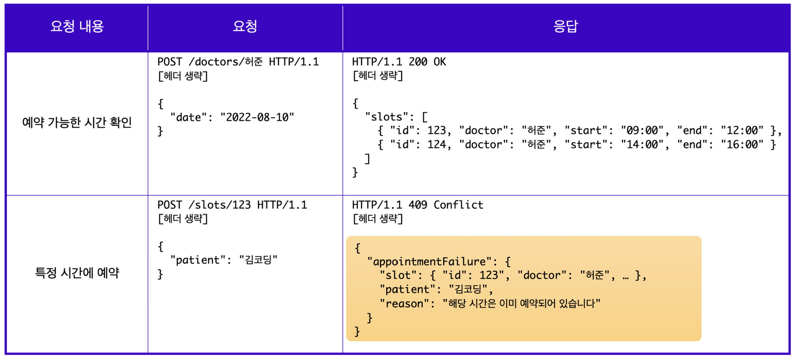

# 1. REST API

## 1. REST API란?

웹에서 사용되는 데이터나 자원을 HTTP URI로 표현하고, HTTP 프로토콜을 통해 요청과 응답을 정의하는 방식

 

## 2. REST API 디자인 방법: 리차드슨의 REST 성숙도 모델

- 0단계: HTTP 사용
- 1단계: 개별 리소스와의 통신 준수
- 2단계: HTTP 메소드 원칙 준수 (까지만 지켜도 좋은 API 디자인이라 할 수 있음)
- 3단계: HATEOAS 원칙 준수

 

## 3. REST API 성숙도 모델 - 0단계

- 단순히 HTTP 프로토콜을 사용하기만 해도 되지만, 이 경우 해당 API를 REST API라고는 할 수 없음
- REST API를 작성하기 위한 기본 단계일뿐

 

## 4. REST API 성숙도 모델 - 1단계

- 개별 리소스와의 통신 준수 즉, 모든 자원은 개별 리소스에 맞는 Endpoint를 사용해야 함
- 요청하고 받는 자원에 대한 정보를 응답으로 전달해야 함
- 엔드포인트 작성시에는 동사, HTTP 메소드, 혹은 어떤 행위에 대한 단어 사용은 지양하고 리소스에 집중해 명사 형태의 단어로 작성할 것 (ex. appointment)
- 리소스 전달 시, 리소스 사용에 대한 성공/실패 여부도 반환해야 함 (ex. appointmentFailure)

 

## 5. REST API 성숙도 모델 - 2단계

- CRUD에 맞게 적절한 HTTP 메소드를 사용하는 것에 중점을 둠
- 예를 들어 조회(READ)를 위해서는 GET메소드를 사용하며, 이때 GET 메소드는 body를 가지지 않기에 query parameter를 사용해 필요한 리소스 전달
- 혹은 생성(CREATE)을 위해서는 POST메소드를 사용하며, 응답은 새롭게 생성된 리소스를 보내주기에 응답코드는 `201 Created`로 명확히 작성하여 관련 리소스를 클라이언트가 Location 헤더에 작성된 URI를 통해 확인하게끔 하면 됨

 

## 6. HTTP 메소드 사용시 규칙

- `GET`: 서버의 데이터를 변화시키지 않는 요청에 사용
- `POST`: 요청마다 새로운 리소스 생성하고, `PUT` 메소드는 요청마다 같은 리소스 반환하며 이를 *멱등(idmpotent) 하다고 함.*동일한 요청을 한 번 보내는 것과 여러 번 연속으로 보내는 것이 같은 효과를 지니고, 서버의 상태도 동일하게 남을 때, 해당 HTTP 메서드가 멱등성을 가졌다고 말함. (출처: [mdn](https://developer.mozilla.org/ko/docs/Glossary/Idempotent))
- `PUT`: 교체과 `PATCH`: 수정 메소드도 구분 필요.

 

## 7. REST API 성숙도 모델 - 3단계

- HATEOAS(Hypermedia As The Engine Of Application State)는 하이퍼미디어 컨트롤을 적용함.
- 응답에 리소스의 URI를 포함한 링크요소를 삽입하여 작성해야 하며, 링크 요소는 응답을 받은 뒤 할 수 있는 다양한 액션들을 위해 많은 하이퍼미디어 컨트롤을 포함
- 즉, 응답 내에 새로운 링크를 넣어 새로운 기능에 접근할 수 있도록 하는 것이 포인트.

 

## 8. Open API와 API Key

### Open API

공공데이터는 이용 가능하나, 정해진 수칙에 따라 사용

### API Key

서버의 문을 여는 열쇠이며, 로그인한 이용자에게 자원에 접근할 수 있는 권한을 API Key 형태로 제공, 데이터 요청 시 API Key를 같이 전달해야 원하는 응답을 받을 수 있음

 

## 9. Message State 요청

### root-endpoing(혹은 root-URL)

- API로 요청을 서버와 통신할 때, 서버가 요청을 수락하는 시작점
- 일반적으로 root-endpoint는 도메인주소의 루트(/)를 가리킴
- 마찬가지로 Message State Server의 URL을 기준으로 파악할 수 있는 root-endpoint는 Message States Server의 가장 마지막 Location인 호스트의 루트(/)임 (ex. Github API의 root-endpoint는 <https://api.github.com>)

### path

- path 혹은 url-path는 API를 통해 서버와 통신할 때, 서버와 통신할 수 있는 key 역할
- 서버에 정의된 문자열에 따라 path가 달라짐 (ex. <https://api.github.com/user> 에서는 'user'가 path)
